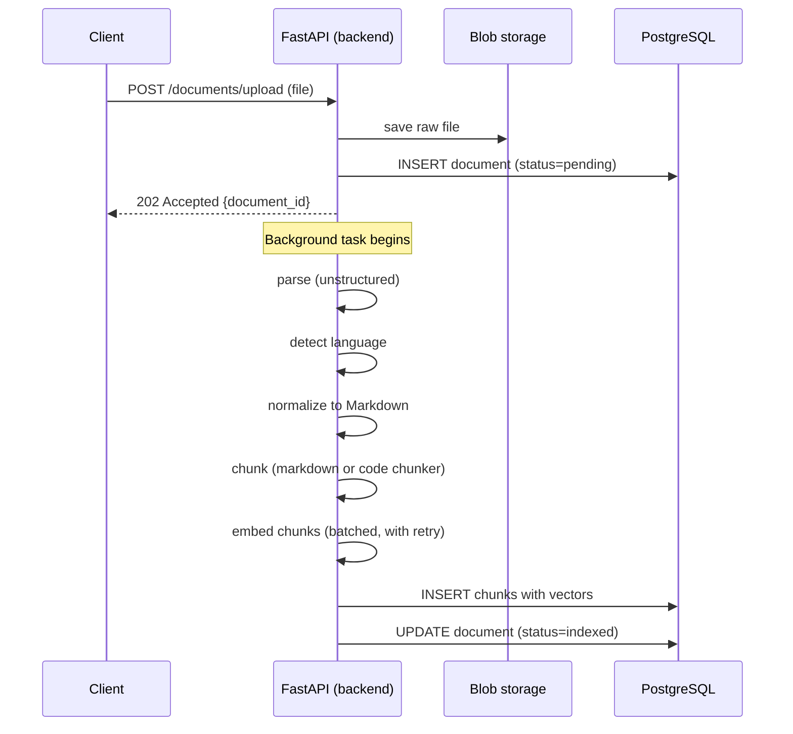
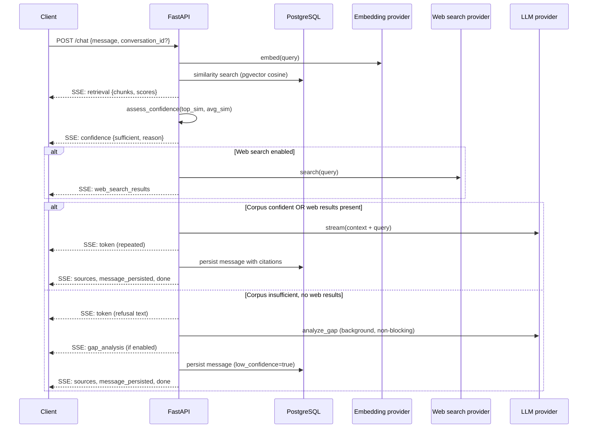

# Architecture

This document covers the internal design of Mentor for developers who want to understand or extend the codebase. For deployment instructions see [DEPLOYMENT.md](DEPLOYMENT.md). For configuration reference see [CONFIGURATION.md](CONFIGURATION.md).

---

## High-level data flow

### Ingestion



Clients poll `GET /documents/{id}` to check status. The ingestion pipeline is a background task — the upload endpoint returns immediately.

### Retrieval and chat



---

## Orchestrator paths

The chat orchestrator (`backend/app/chat/orchestrator.py`) has four distinct execution paths, selected at runtime based on corpus confidence and whether the user enabled web search:

| Path | Corpus confident | Web search | Behaviour |
|------|-----------------|------------|-----------|
| 1 | Yes | No | Stream answer grounded in corpus only |
| 2 | Yes | Yes | Stream answer grounded in corpus + web context |
| 3 | No | Yes | Stream answer grounded in web context only |
| 4 | No | No | Emit refusal; run gap analysis (non-blocking) |

Confidence is assessed in `backend/app/chat/confidence.py` using two thresholds:
- `RETRIEVAL_MIN_TOP_SIMILARITY` — minimum score of the best chunk
- `RETRIEVAL_MIN_AVG_SIMILARITY` — minimum average score across the top-N window

Both must be met for confidence to be "sufficient". This prevents the case where one fluke high-score chunk passes the top threshold but the rest of the retrieval is poor.

---

## Provider abstraction

Each external service category has an abstract base class (ABC) and one or more concrete implementations. Selecting a provider is a runtime decision based on environment variables; the rest of the codebase never imports a concrete provider directly.

### LLM providers

**Interface:** `backend/app/providers/llm.py` — `LLMProvider` ABC

```python
class LLMProvider(ABC):
    @property
    @abstractmethod
    def identifier(self) -> str: ...

    @abstractmethod
    async def generate(self, messages, system_prompt, model, max_tokens, temperature) -> GenerationResult: ...

    @abstractmethod
    async def stream(self, messages, system_prompt, model, max_tokens, temperature) -> AsyncIterator[str]: ...

    def model_for_tier(self, tier: str) -> str | None:
        return None  # override to support tiered models
```

**Implementations:**
- `StubLLMProvider` — returns `"[stub llm response]"`, no API calls
- `AnthropicLLMProvider` — `backend/app/providers/anthropic_llm.py`

**Factory:** `get_llm_provider()` in `backend/app/providers/llm.py`

### Embedding providers

**Interface:** `backend/app/providers/embeddings.py` — `EmbeddingProvider` ABC

```python
class EmbeddingProvider(ABC):
    @property
    @abstractmethod
    def identifier(self) -> str: ...

    @abstractmethod
    async def embed(self, texts: list[str]) -> list[list[float]]: ...
```

**Implementations:**
- `StubEmbeddingProvider` — deterministic random 1536-dim vectors (seeded from text hash)
- `OpenAIEmbeddingProvider` — `backend/app/providers/openai_embeddings.py`
- `AzureOpenAIEmbeddingProvider` — `backend/app/providers/azure_openai_embeddings.py`

**Factory:** `get_embedding_provider()` in `backend/app/providers/embeddings.py`

### Web search providers

**Interface:** `backend/app/providers/web_search.py` — `WebSearchProvider` ABC

```python
class WebSearchProvider(ABC):
    @property
    @abstractmethod
    def identifier(self) -> str: ...

    @abstractmethod
    async def search(self, query: str, max_results: int) -> list[WebSearchResult]: ...
```

**Implementations:**
- `StubWebSearchProvider` — canned fake results
- `TavilyWebSearchProvider` — `backend/app/providers/tavily_search.py`

---

### Adding a new LLM provider (worked example: Google Gemini)

**Step 1.** Create `backend/app/providers/gemini_llm.py`:

```python
from collections.abc import AsyncIterator
import google.generativeai as genai
from app.providers.llm import ChatMessage, GenerationResult, LLMProvider

class GeminiLLMProvider(LLMProvider):
    def __init__(self, api_key: str, model: str = "gemini-1.5-flash") -> None:
        self._model_name = model
        genai.configure(api_key=api_key)
        self._client = genai.GenerativeModel(model)

    @property
    def identifier(self) -> str:
        return f"gemini:{self._model_name}:v1"

    async def generate(self, messages, system_prompt, model=None, max_tokens=2048, temperature=0.2) -> GenerationResult:
        prompt = system_prompt + "\n\n" + messages[-1].content
        response = await self._client.generate_content_async(
            prompt,
            generation_config=genai.GenerationConfig(
                max_output_tokens=max_tokens,
                temperature=temperature,
            ),
        )
        return GenerationResult(
            text=response.text,
            input_tokens=response.usage_metadata.prompt_token_count,
            output_tokens=response.usage_metadata.candidates_token_count,
            model=self._model_name,
            stop_reason="end_turn",
        )

    async def stream(self, messages, system_prompt, model=None, max_tokens=2048, temperature=0.2) -> AsyncIterator[str]:
        prompt = system_prompt + "\n\n" + messages[-1].content
        async for chunk in await self._client.generate_content_async(
            prompt,
            stream=True,
            generation_config=genai.GenerationConfig(max_output_tokens=max_tokens),
        ):
            yield chunk.text
```

**Step 2.** Add to `backend/app/config.py`:

```python
GEMINI_API_KEY: SecretStr | None = None
GEMINI_MODEL: str = "gemini-1.5-flash"
```

And in `_require_provider_credentials`:

```python
if self.LLM_PROVIDER == "gemini":
    if self.GEMINI_API_KEY is None:
        raise ValueError("LLM_PROVIDER=gemini requires: GEMINI_API_KEY")
```

**Step 3.** Add to `get_llm_provider()` in `backend/app/providers/llm.py`:

```python
case "gemini":
    from app.providers.gemini_llm import GeminiLLMProvider
    return GeminiLLMProvider(
        api_key=settings.GEMINI_API_KEY.get_secret_value(),
        model=settings.GEMINI_MODEL,
    )
```

**Step 4.** Add `google-generativeai` to `backend/requirements.txt`.

That's the complete change. No modifications to the orchestrator, API layer, or any other file.

---

## Database schema

All tables use UUID primary keys. Timestamps are timezone-aware.

### `documents`

Tracks every uploaded file through its processing lifecycle.

| Column | Type | Notes |
|--------|------|-------|
| `id` | UUID | Primary key |
| `filename` | varchar(512) | Original upload filename |
| `content_type` | varchar(127) | MIME type |
| `size_bytes` | int | File size |
| `blob_path` | varchar(1024) | Path in blob store |
| `normalized_content` | text | Markdown output from normalizer |
| `detected_language` | varchar(10) | e.g. `en`, `el` |
| `file_category` | varchar(20) | `document` or `code` |
| `status` | varchar(30) | `pending` → `processing` → `indexed` or `error` |
| `error_message` | text | Set on failure |
| `duplicate_check` | JSONB | Duplicate detection result, if any |
| `deleted_at` | timestamptz | Soft delete; excludes from search |

### `chunks`

One row per chunk produced by the chunker. The `embedding` column holds the pgvector data.

| Column | Type | Notes |
|--------|------|-------|
| `id` | UUID | Primary key |
| `document_id` | UUID | Foreign key → `documents.id` (CASCADE DELETE) |
| `chunk_index` | int | Position within the document |
| `text` | text | Raw chunk text |
| `token_count` | int | Approximate token count |
| `embedding` | vector(1536) | pgvector column; NULL until embedded |
| `embedding_model` | text | Provider identifier used to produce the embedding |
| `metadata` | JSONB | Chunker-specific metadata (heading path, line numbers, etc.) |

The HNSW index is on `embedding` with cosine distance:
```sql
CREATE INDEX ON chunks USING hnsw (embedding vector_cosine_ops);
```

Retrieval uses: `1 - (c.embedding <=> CAST(:vec AS vector)) AS score`

### `conversations`

One row per chat thread.

| Column | Type | Notes |
|--------|------|-------|
| `id` | UUID | Primary key |
| `user_id` | varchar(255) | Defaults to `"dev"` (no auth) |
| `title` | varchar(255) | Generated asynchronously from the first message |
| `updated_at` | timestamptz | Updated on every new message; used for ordering |
| `deleted_at` | timestamptz | Soft delete |

### `messages`

One row per user or assistant message.

| Column | Type | Notes |
|--------|------|-------|
| `id` | UUID | Primary key |
| `conversation_id` | UUID | Foreign key → `conversations.id` (CASCADE DELETE) |
| `role` | varchar(20) | `user` or `assistant` |
| `content` | text | Message text (citations stripped from assistant messages) |
| `message_index` | int | Position in thread (0-based) |
| `retrieved_chunk_ids` | JSONB | Chunk IDs retrieved for this message |
| `cited_chunk_ids` | JSONB | Chunk IDs that appeared in the LLM's `<cited_chunks>` tag |
| `model_used` | text | Model identifier used for generation |
| `low_confidence` | bool | True if the message was a refusal |
| `web_search_used` | bool | True if web search was used |
| `web_search_results` | JSONB | Full web search results stored with the message |

---

## Curation features

Three features layered on top of the core ingestion and chat flows.

### Memory extraction

When a conversation becomes long, or when a topic shift or session boundary is detected, the UI suggests extracting a memory. On confirmation, `POST /curation/conversations/{id}/extract-memory` calls the LLM with the full conversation transcript and a structured extraction prompt. The result is saved as a new document (type `memory`).

Code: `backend/app/curation/memory_extractor.py`, triggered by `backend/app/curation/triggers.py`.

### Duplicate detection

When a document reaches `indexed` status, `backend/app/curation/duplicate_detector.py` compares the new document's chunk embeddings against all existing chunk embeddings using pgvector similarity. If more than `DUPLICATE_MATCH_RATIO` of the new document's chunks exceed the `DUPLICATE_NEAR_THRESHOLD` similarity with another document's chunks, the document is flagged in `documents.duplicate_check`.

### Gap analysis

When the orchestrator takes path 4 (refusal, no web search), it fires `analyze_gap()` from `backend/app/curation/gap_analyzer.py` as a non-blocking follow-up. The function calls the LLM with the rejected query and the top retrieved chunks, and asks for a structured JSON response identifying the missing topic and what document types would fill it. The result is emitted as a `gap_analysis` SSE event.

---

## Testing

The test suite has three layers:

### Backend unit/integration tests

Location: `backend/tests/`

```bash
make test-backend   # runs inside the backend Docker container
# or directly:
docker compose exec backend python -m pytest tests/ -v --tb=short
```

Coverage: ingestion pipeline, chunking, embedding providers, LLM providers, web search providers, orchestrator (all four paths), chat API, document API, curation features, edge cases.

Tests use a separate `mentor_test` database. Provider tests mock HTTP calls with `httpx.MockTransport` or `unittest.mock`.

### Frontend unit tests

Location: `frontend/src/__tests__/`

```bash
make test-frontend  # runs inside the frontend Docker container
```

Coverage: SSE event parsing, message components, source cards, low-confidence notice, document list.

### E2E tests

Location: `e2e/`

```bash
RUN_E2E=1 make test   # brings up docker compose, runs suite, tears down
# or against a running stack:
E2E_SKIP_COMPOSE=1 bash scripts/run-e2e.sh
```

E2E scenarios: full ingestion + status polling, grounded answer, off-topic refusal (honesty check), web search opt-in, multi-turn conversation + delete. These are slow by design — they exercise the real database and real stub providers end-to-end.

### Running a subset

```bash
# Single test file
docker compose exec backend python -m pytest tests/test_chat_orchestrator.py -v

# By marker or keyword
docker compose exec backend python -m pytest tests/ -k "confidence" -v
```
