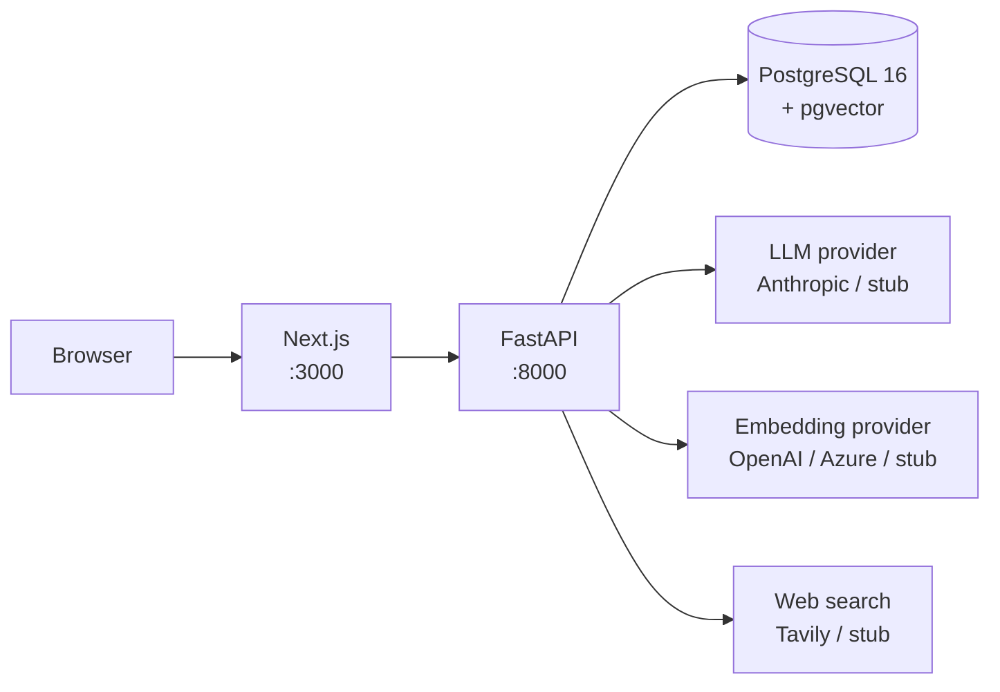

# Mentor

A self-hosted RAG assistant for indexing and querying your team's code and documentation.

---

## Why Mentor

- **Honest refusals.** If the corpus doesn't contain relevant information, Mentor says so. Confidence is assessed quantitatively via vector similarity thresholds — low-confidence retrievals produce a refusal, not a hallucination.
- **Provider-agnostic.** LLM, embedding, and web search backends are swappable via environment variable. Anthropic Claude, OpenAI, and Azure OpenAI are supported today; adding a new provider is a small, isolated change. See [Architecture](ARCHITECTURE.md#provider-abstraction).
- **Self-hosted.** Your documents never leave your infrastructure. The entire stack runs via Docker Compose — no external data plane required.
- **Curation-aware.** Mentor tracks knowledge gaps (what questions your corpus can't answer), detects near-duplicate documents on upload, and can extract durable facts from conversations as saved notes.
- **Structure-aware chunking.** Markdown headings and source code function boundaries are respected when splitting documents — content is not split arbitrarily at fixed byte offsets.

---

## Quickstart

```bash
git clone https://github.com/YOUR_USERNAME/mentor.git
cd mentor
cp .env.example .env
docker compose up
```

Open http://localhost:3000. No API keys required — the default configuration uses stub providers, which is sufficient for local evaluation.

- Frontend: http://localhost:3000
- Backend API + interactive docs: http://localhost:8000/docs
- Health check: http://localhost:8000/health

To use real embeddings or a real LLM, edit `.env` and restart. See [CONFIGURATION.md](CONFIGURATION.md).

---

## UI (screenshots)

*Real screenshots pending a first ingest run. ASCII mockups below. TODO: replace with actual screenshots saved to `docs/images/`.*

**Chat — grounded answer with source citations:**

```
┌──────────────────────────────────────────────────────────────────┐
│  Mentor                                             [Documents]  │
├──────────────────────────────────────────────────────────────────┤
│                                                                  │
│  > How does the ingestion pipeline handle PDF files?            │
│                                                                  │
│  ┌─ Mentor ──────────────────────────────────────────────────┐  │
│  │  PDF files are handled by the document parser, which      │  │
│  │  uses unstructured to extract raw text. The text is       │  │
│  │  then normalized to Markdown format before chunking.      │  │
│  │  [chunk:a1b2] [chunk:c3d4]                                │  │
│  │                                                           │  │
│  │  📁 From your documents                                   │  │
│  │  ├── architecture.md  92%                                 │  │
│  │  └── ingestion_guide.md  87%                              │  │
│  └───────────────────────────────────────────────────────────┘  │
│                                                                  │
│  [ Ask a question...                          ] [🌐] [Send]     │
└──────────────────────────────────────────────────────────────────┘
```

**Low-confidence response with gap analysis:**

```
┌─ Mentor ────────────────────────────────────────────────────────┐
│  I don't have enough information in the indexed documents       │
│  to answer this confidently.                                    │
│                                                                 │
│  Gap: "Kubernetes deployment"                                   │
│  Related topics present: Docker, docker-compose, containers     │
│  Suggested additions: Helm chart docs, k8s deployment runbook   │
│                                                                 │
│  [Try with web search 🌐]                                       │
└─────────────────────────────────────────────────────────────────┘
```

---

## Use cases

- **Engineering onboarding.** Index your runbooks, ADRs, and READMEs. New hires can ask questions in plain language and get answers with source citations instead of hunting through wikis.
- **Internal documentation search.** Replace "search the wiki and hope" with a chat interface that cites exactly which document it's drawing from — and tells you when it doesn't know.
- **Codebase Q&A.** Upload source files alongside their documentation. Ask how a specific subsystem works and get answers grounded in actual code and design docs.
- **Design decision archaeology.** Index meeting notes and decision logs. Ask "why did we choose X over Y" and get answers pointing to the original discussion.

---

## Architecture



The backend is a single FastAPI process that handles document ingestion, vector search, and chat orchestration. PostgreSQL with the pgvector extension stores both document metadata and 1536-dimensional embeddings. All external services (LLM, embeddings, web search) are behind provider interfaces — swapping one requires only an environment variable change.

See [ARCHITECTURE.md](ARCHITECTURE.md) for the full data flow, provider interface contracts, database schema, and a worked walkthrough of adding a new provider.

---

## Providers

### LLM

| Provider | `LLM_PROVIDER` | Notes |
|----------|----------------|-------|
| Stub | `stub` | **Default.** Placeholder responses. No key needed. |
| Anthropic (Claude) | `anthropic` | Requires `ANTHROPIC_API_KEY`. Haiku for standard queries, Sonnet for regenerations. |

### Embeddings

| Provider | `EMBEDDING_PROVIDER` | Notes |
|----------|----------------------|-------|
| Stub | `stub` | **Default.** Deterministic random vectors — no meaningful similarity. Good for dev. |
| OpenAI direct | `openai` | Requires `OPENAI_API_KEY`. Recommended for personal use. |
| Azure OpenAI | `azure_openai` | Requires endpoint + key + deployment name. For Azure tenants. |

### Web search

| Provider | `WEB_SEARCH_PROVIDER` | Notes |
|----------|----------------------|-------|
| Stub | `stub` | **Default.** Canned fake results — no key needed. |
| Tavily | `tavily` | Requires `TAVILY_API_KEY`. Free tier: 1000 searches/month. |

Web search is **off by default** and **opt-in per question** via the toggle in the chat UI. It is never automatic.

---

## Configuration

See [CONFIGURATION.md](CONFIGURATION.md) for every setting, its default, and when to change it.

## Deployment

See [DEPLOYMENT.md](DEPLOYMENT.md) for local development, single-VPS, and cloud-managed deployment recipes.

## Contributing

See [CONTRIBUTING.md](CONTRIBUTING.md).

---

## Roadmap

- [x] **Stage 1** — Project skeleton: FastAPI + Postgres + pgvector + Docker Compose + Next.js placeholder
- [x] **Stage 2** — Ingestion pipeline: file upload, parsing, language detection, Markdown normalization
- [x] **Stage 3** — Chunking + vector search: markdown/code-aware chunking, 1536-dim storage, similarity search
- [x] **Stage 4** — Real embeddings: OpenAI direct + Azure OpenAI providers, retry, stale detection, health checks, reindex endpoint
- [x] **Stage 5** — LLM chat: Anthropic provider, grounded RAG with confidence gating, SSE streaming, citation extraction, conversation history
- [x] **Stage 6** — Frontend: chat UI, document browser, source citation display, streaming, source drawers
- [x] **Stage 7** — Web search (opt-in per question via Tavily/stub) + test hardening (backend 160+, frontend 35+, E2E suite)
- [x] **Stage 8** — Curation: memory extraction from conversations, near-duplicate detection, gap analysis on low-confidence queries
- [ ] **Stage 9** — Authentication (deferred until core product is stable)

---

## Status

Personal project, actively developed. MIT licensed. No support guarantees — bugs and rough edges exist.

**Authentication is not implemented.** All API endpoints are currently unauthenticated. Do not expose a running instance to the public internet without adding authentication or placing it behind a reverse proxy with access control.

---

## License

MIT — see [LICENSE](LICENSE).

Built by Joan Karantourou.
